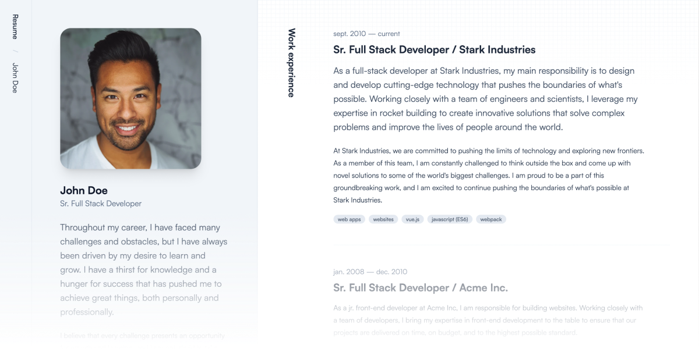

# Crisp Resume Starter Kit

Quickly want to spin up a great looking resume? Crisp Resume has got you covered. A fully built resume that is easy to manage and extend with Statamic.

## Blocks

- Contact details
- Experience
- Skills
- Photo masonry
- Photo full width
- Content

## Features

- Block based page builder
- Crisp looking layout
- Responsive images
- TailwindCSS
- Fully responsive

## Demo

I've build my own resume with Crisp (of course), which you can preview at [https://resume.sjoerdstottelaar.nl](https://resume.sjoerdstottelaar.nl).

## Installation

To install Crisp simply follow the [installing a starter kit guide](https://statamic.dev/starter-kits/installing-a-starter-kit]).

### Fresh installation

Using the Statamic CLI tool run the following command:
`statamic new my-site vendor/starter-kit`

I recommend only installing it into a new fresh installation.

## Extending the starter kit

Once installed, it's all you baby! I recommend tweaking it to your liking, but you can roll with it as is.

## License

Resume is a commercial starter kit so you must purchase a license to use it.

## Having issues or found a bug?

Open up a Github issue and I'll fix it the same (work)day. Promised.

## Guarentee

I'm so confident that you'll like it that I'm offering a full refund + $5 (for your trouble) if you're not satisfied. No questions asked. Just reach out to me, links are on my personal website [https://sjoerdstottelaar.nl](https://sjoerdstottelaar.nl)
